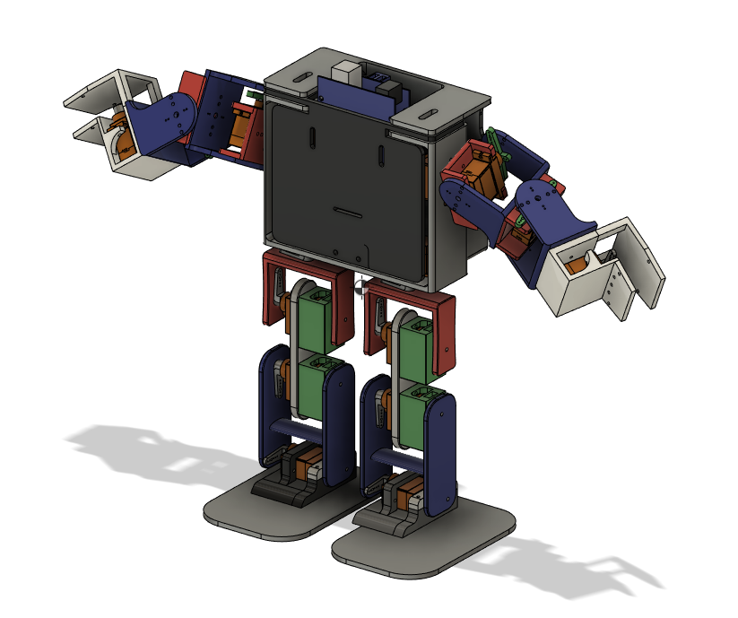

The robot is a 16 degrees of freedom voice controlled biped walker robot, version 1. 
This robot was mostly a learning experience.

The main problem that hampers its walking performance is the orientation of the foot joints and the torque of the servos.
The next version will have more powerful servos and foot joints that rotate sideways and not forward and back.
For the mechanical design: I will use a different more curved design for the legs. 
For the program, I will use a cyclic system with non blocking loops. This version I made the mistake of adding loops in the main loop.
Next version will have a custom circuit board to reduce weight, and lower the center of mass.

This repository contains:

- Step File of the Assembly
- Arduino sketch
- Video link of the robot squatting: https://youtu.be/8kNGdHexv9c
- Video Link of the robot walking: https://youtu.be/5jY2Vtdq-3I

Robot Assembly:

